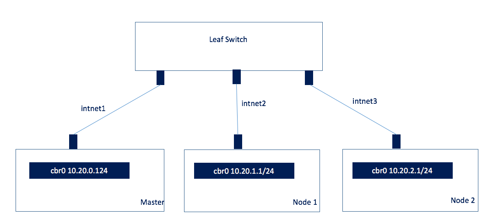
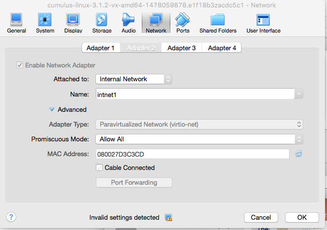

# Kubernetes with Trireme and Cumulus Host Routing

In this tutorial we will describe how on can setup a large bare metal Kubernetes cluster using simple layer 3 networking 
and achieving strong isolation with Trireme and the kubernetes network policy. The setup can be repeated 
in a laptop environment using VirtualBox. We assume a topology as in the picture below. 



Three hosts connected to a leaf switch. In a VirtualBox environment use Internal Network interfaces to create intnet1, intnet2, intnet3. 
Then attach hosts and leaf switch VM in these interfaces. An example configuration is shown below. 



We are trying to minimize all manual configurations. For this reason the Leaf Switch will also operate as a DHCP 
server (or DHCP relay), and it will automatically allocate IP addresses to all the interfaces. This is the only 
configuration that we need to do. Once the hosts boot and get an IP address, the Kubernetes master will start
and take care of all other configurations. 

For our experiments we use the Cumulus VX that is a virtual machine
with all router capabilities. The three hosts are directly attached to the router over a /30 interface, and we have
enabled DHCP in the router so that the hosts can automatically get their IP addresses. The DHCP configuration for
the Cumulus router can be found in [dhcpd.conf](Cumulus/dhcpd.conf). The full configuration of the Cumulus Leaf switch 
is captured in [config](Cumulus/config) and [/etc/network/interfaces](Cumulus/interfaces).

# Host Configuration

The configuration on every host is bare minimum. Make sure that Docker is running and that the host has network
connectivity. When the hosts come up they should be able to get an IP address through the Cumulus router and they
should not need any other configuration. 

Follow the standard instructions in http://kubernetes.io/docs/getting-started-guides/kubeadm/ to install the kubeadm 
tools in all of the hosts. However, stop before initializing the master or slave nodes and follow the steps below 

## Configuring Kubernetes and Kubenet 
We will use the simple kubenet plugin that enables simple bridge networking. We don't need anything more complex
than that for our deployment. For this reason create the file "/etc/systemd/system/kubelet.service.d/20-kubenet.conf"

```bash
printf '[Service]\nEnvironment="KUBELET_NETWORK_ARGS=--network-plugin=kubenet --reconcile-cidr --pod-cidr=10.20.0.0/24 "\n' > /etc/systemd/system/kubelet.service.d/20-kubenet.conf
```

In your worker nodes (minions), use a similar command to properly configure the kubenet plugin 
```bash
printf '[Service]\nEnvironment="KUBELET_NETWORK_ARGS=--network-plugin=kubenet --reconcile-cidr "\n' > /etc/systemd/system/kubelet.service.d/20-kubenet.conf
```

You are no all set. Follow the rest of the instructions for installing kubernetes. In the master:

```bash
kubeadm init --pod-network-cidr=10.20.0.0/16 
```

When kubeadm is complete it will provide the command that you need to use for the other nodes and it will look like this:

```bash
kubeadm join --token=0d7bea.5f9b312cbc75b342 192.168.59.105
```

What happens in the background is that the Kubernetes manager will allocate a /24 subnet for each of the hosts and the 
kubelet will configure every node with this CIDR. You don't have to do any manual configuration. 

At this point we have a fully working Kubernetes cluster, but most likely PODs will not be able to talk to each
other since we have not configured any routes in the network to access the POD networks. 

## Deploy Host Routing with Cumulus Quagga
The Cumulus Quagga router is distributed a simple Docker container. We have enhanced this container with a basic start up script. 
The container will instantiate a router, get the local bridge information from the host and advertise them to the next-hop router
using BGP. All connectivity is L3 and all techniques around ECMP and resiliency apply. 

In order to deploy the Quagga router we have created a simple Kubernetes daemonset.

```bash 
kubectl create -f Kubernetes/router.yaml
```

The daemonset will deploy an instance of the router in every host advertise the routes. 

> NOTE: The bridges will only be created after you start the first deployment. 

Try to create a nginx deployment 

```bash
kubectl run my-nginx --image=nginx --replicas=2
```

Get the PODs from the deployment 
```bash 
kubect get pods
NAME                        READY     STATUS    RESTARTS   AGE
my-nginx-2723453542-ee9ib   1/1       Running   0          10s
my-nginx-2723453542-ym48s   1/1       Running   0          10s
```

Describe the PDOs and get the IP addresses of the PODs
```bash
kubectl desribe pod my-nginx-2723453542-ee9ib | grep IP
IP:		10.20.1.118
```

You should now be able to access this POD with "curl http://10.20.1.118" from any of the other hosts. 

# Isolation with Trireme 
As described above, each Pod in the Kubernetes cluster gets a different IP address and all Pods can commmunicate with each
other. Obviously this is not always desirable from a security point of view. The Kubernetens network policy provides
the mechanism to isolate Pods. However, there is no direct implementation. The Trireme integration enables the Trireme
library to be used for isolation. 

You can follow the instructions in https://github.com/aporeto-inc/trireme-kubernetes/tree/master/deployment to deploy
the Trireme integration. Basically, the only think you need to do is deploy an additional daemonset.

```bash
# Create a shared secret 
Kubernetes/createPSK.sh
# Deploy Trireme with a shared secret implementation as a daemonset
kubectl create -f Kubernetes/daemonsetPSK.yaml
```


# Conclusion
What we demonstrated is a completely automated way to deploy a large scale Kubernetes cluster in bare metal servers
with minimal configuration. The steps only require:
1. Configure your Top-Of-Rack (Leaf) switches with IP addresses per interface.
2. Start the Kubernetes master and give it a large subnet to use for Pods (let's say a /16) 
3. Deploy routing and security through daemonsets and let Kubernetes itself manage the health of these processes. 

Essentially the only manual step is step 1 above (configuring the top of rack switch). Even the installation of the 
Kubernetes software can be automated by doing it once and installing a standard bootp/tftp infrastructure to 
boot the servers automatically through an imutable image. 


