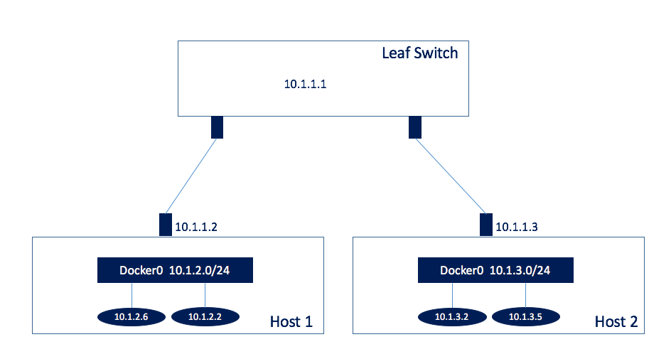

# Simplified Networking for Containers and Kubernetes

The basic Kubernetes networking model assumes a very simple network configuration. Every Kubernetes node 
(minion) is configured with one IP address for all management related functions and as well as a routable
subnet (for example a /24) where all containers or Kubernetes PODs will get an IP address from. This 
simple architecture minimizes the requirements from the physical infrastructure. In a leaf/spine data 
center architecture, leaf switches need routes to each of the container subnets with a next-hop equal
to the corresponding server IP. Local routing inside very host can minimize all other functions. 

The following picture illustrates this architecture. We show two servers attached to leaf switch. The 
server interfaces have IP addresses 10.1.1.2 and 10.1.1.3 (possibly distributed even through DHCP
when they boot). The leaf switch has an IP address 10.1.1.1. In each of the hosts there is a network
associated with container (10.1.2.0/24 and 10.1.3.0/24) and all containers instantiated in the host 
get an IP address out of these container subnets. 



In order to completely automate the deployment of such an infrastructure and minimize the configuration
requirements one has to achieve the following:

1. When a new server is started under a leaf switch it should automatically get an IP address. This can 
be achieved by DHCP or using unumbered interfaces as recommended in https://cumulusnetworks.com/routing-on-the-host/
2. Every new server must be associated with a container network. This is part of the server configuratio
and we will describe how it can be done in the next section.
3. When a server is started, it should automatically advertise its container network to the leaf switch
and the rest of the infrastructure minimizing human intervention. Although this can be automated 
with static routes at the leaf switches, it can also be implemented with a routing protocol. 
The easiest way to achieve this is by  running a routing protocol on every server and advertising the
corresponding container route to the  leaf switch. 

Note that in the above architecture there are no convergence issues that one has to worry about. The only
routes advertised to the network are /24 subnets (one per server) and one could do implement aggregation
on every leaf switch and advertise much larger subnets to the core network. There is *no route advertisement* 
for every container. No L2 networks and no VLANs. 

In the following section we describe some basic configurations for enabling host routing to advertise docker networks.

## Isolation with Trireme
The biggest drawback of the above architecture is that there is no network isolation. Every container or POD can
communicate with any other container. One can try to isolate containers with access control lists or potentially
VLANs but then the network configuration becomes complex or there is a need for shared state between the 
end-hosts that needs to be propagated. This is exactly where Trireme comes in. Trireme was designed to decouple
security from network. By installing the Trireme library on each host, one will be able to achieve isolation
while keeping the network simple as described in this architecture.


# Host Configuration

## Configure Docker 

This is an *one-time* configuration that is needed in every host. Essentially we need to configure
a routable subnet where all the containers will be attached to. Note that there is only one restriction
on what is the subnet IP. Since we will use routing to advertise the subnet it has to be 
unique in your data center network. Note also that the advertisement will only happen when a host 
is activated and not every time a new container is added or removed in the data center. 

### Using the daemon configuration 

The host must be configured with the bridge that all Docker containers will be activated on. This can be done
either by creating a new network using Docker or by simply starting the docker daemon with the 
correct parameters. We always recommend to disable the userland proxy of Docker since its extremely
slow. We recommend the following mechanism to start the Docker daemon. This can be achieved
by configuring your systemctl controls. The easiest way to find the file is to do :

```bash 
sudo systemctl status service 
● docker.service - Docker Application Container Engine
   Loaded: loaded (/lib/systemd/system/docker.service; enabled; vendor preset: enabled)
   Active: active (running) since Tue 2016-11-22 16:31:07 PST; 59s ago
     Docs: https://docs.docker.com
 Main PID: 6560 (dockerd)
   Memory: 17.8M
      CPU: 329ms
   CGroup: /system.slice/docker.service
           ├─6560 /usr/bin/dockerd -H fd:// --userland-proxy=false --bip=172.0.0.1/24
           └─6567 docker-containerd -l unix:///var/run/docker/libcontainerd/docker-containerd.sock --shim docker-containerd-shim --metrics-interval...
```
In the above example the configuration file is in /lib/systemd/system/docker.service

You can edit the file and replace the ExecStart line with the following

```bash
/usr/bin/dockerd -H fd:// --userland-proxy=false --bip=10.1.2.1/24
```

Restart your docker daemon 

```bash 
sudo systemctl daemon-reload
sudo systemctl restart docker
```

If you look at your bridge configuration now for docker0 you will see that its IP address matches
the address above 

```bash
user@ubuntu:~$ ip add show docker0
5: docker0: <NO-CARRIER,BROADCAST,MULTICAST,UP> mtu 1500 qdisc noqueue state DOWN group default
    link/ether 02:42:61:dc:8b:ab brd ff:ff:ff:ff:ff:ff
    inet 10.1.2.1/24 scope global docker0
       valid_lft forever preferred_lft forever
    inet6 fe80::42:61ff:fedc:8bab/64 scope link
       valid_lft forever preferred_lft forever
```

### Using Docker libnetwork 

Alternatively, you can create a new network using the docker libnetwork capability. This will essentially
add a new bridge in the host and give it the specified IP address

```bash
docker network create  \
           --gateway 10.1.2.1 \
           --subnet 10.1.2.0/24 \
           --driver bridge \
           -o "com.docker.network.bridge.enable_ip_masquerade=false”  containers
```

The above configuration will survive reboots. However, if you use this approach you have to make sure 
that you start your containers with the "--net" parameter. As an example

```bash
docker run --net=containers -d nginx 
```

## Configure Host Routing 
We will use the techniques described in https://cumulusnetworks.com/routing-on-the-host/ to create a simple
example. More complex routing configurations can be obviously implemented.

For simplicity in this example we will use the Cumulus docker container to configure a local routing protocol
on the host that will advertise the container network to the rest of the world. This configuration can 
be automated and streamlined and is only needed once a host is booted. In production environments one 
can choose to use the Cumulus Quagga implementation without a docker container. 

First start the Cumulus Router 

```bash 
docker run -t -d --net=host --privileged --name Quagga cumulusnetworks/quagga:denial-latest
```

Note, that the router needs to start in privileged mode in order to be able to modify the routing tables. 
In this example, we will assume that the network interface of the host has some IP address 10.1.1.2 
and that the corresponding router interface is 10.1.1.1. One can use techniques with unumbered interfaces
and DHCP to distribute this IP to the hosts. 

We first need to start the Quagga services
```bash
docker exec Quagga /usr/lib/quagga/quagga restart
```

We then need to configure BGP to communicate with the ToR switch
```bash 
docker exec Quagga /usr/bin/vtysh  \
       -c 'configure t' \
       -c 'router bgp 1000' \
       -c 'neighbor 10.1.1.1 remote-as 10000' 
       -c 'address-family ipv4 unicast' 
       -c 'network 10.1.2.0/24' 
       -c 'neighbor 10.1.1.1 activate’
```
In the above configureation we did the following:
* Started BGP on the AS 1000 for IPv4
* Connected to the neighbor with IP 10.1.1.1
* Advertised to the neighbor the container route 10.1.2.0/24
* Activated the communication

At this point the configuration of the host is complete.

# Configure the Leaf Switch 

Configuring the Leaf Switch is straightforward. We assume that the interface IP is 10.2.1.1. Note that we could 
use a loopback IP to connect the BGP processes as well. 

The configuration is 
```bash
configure t
router bgp 10000
neighbor 10.1.1.2 remote-as 1000
address-family ipv4 unicast
neighbor 10.1.1.2 activate
exit 
exit
```
Essentially its a simple symetrical communication. 

# Operation
If you look at the routes advertised to the Leaf Switch you will notice that the container network is not there. Indeed,
the host router will only advertise this network if at least one container is attached to the network. In order to 
verify, simply create a container 

```bash
docker run  -d --name web nginx 
docker inspect web 
```

From the docker inspect command get the IP address of the container and go to your 
Leaf switch and you can now ping the container. You should be able to simply access the 
nginx web server from anywhere in your data center.
